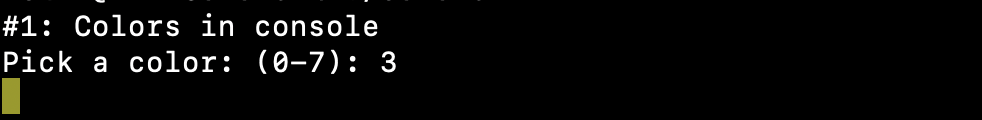
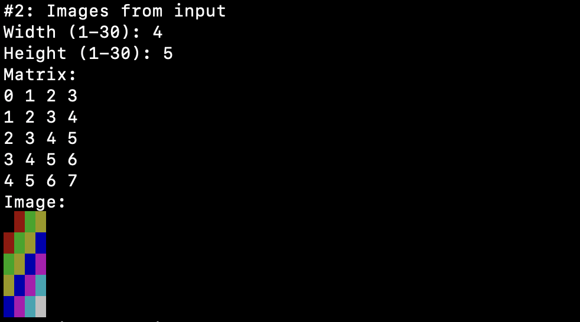
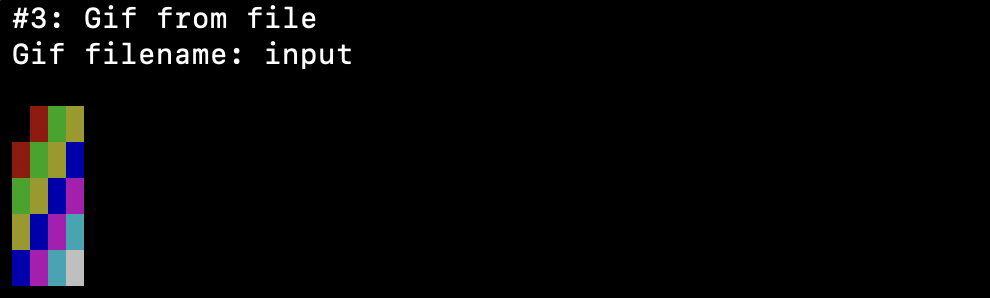

# Colors

## Overview

This repository contains a C program developed in a university course.&#x20;

Across the tasks, the program:

- \#1 prints a space character in a specific color, wich given by the user,
- \#2 prints a matrix using specific colors and the user can set it's height, width and cells.
- \#3 quickly prints 10 matrices (read from a file) to the console one after the other, simulating a "gif"

The code is written in standard C, using a modular structure and explicit memory management.

## Contents

```
.
├── main.c
├── gif.c / gif.h
├── image.c / image.h
├── color.c / color.h
├── files/input.bg1 … input.bg9   # Example input files (task 3)
└── README.md
```

## Build

```bash
gcc main.c gif.c image.c color.c -o colors
```

## Run

```bash
./colors
```

## Input files

The repository includes example input files (`input.bg1`–`input.bg9`) provided for **GIF processing**. These are the same files used during development and testing.

## Screenshots

### Task 1 - Colors in console



### Task 2 - Images from input



### Task 3 – Gif from file



##

